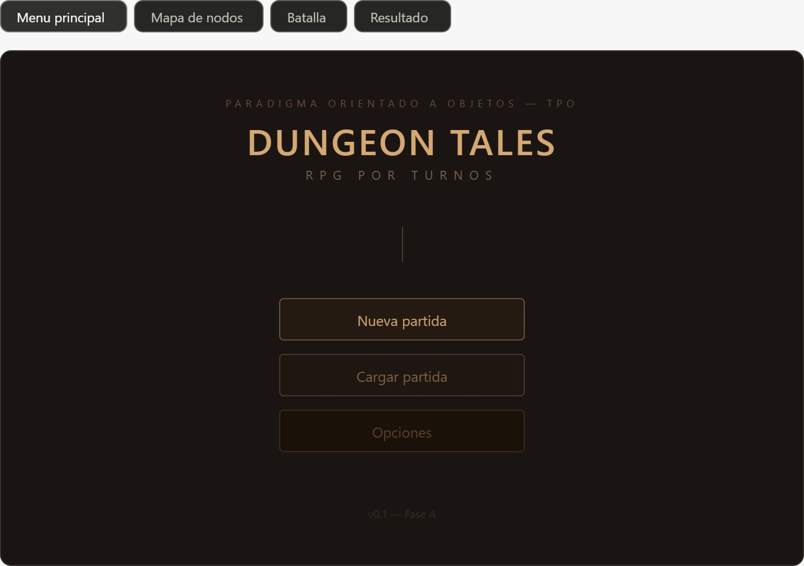
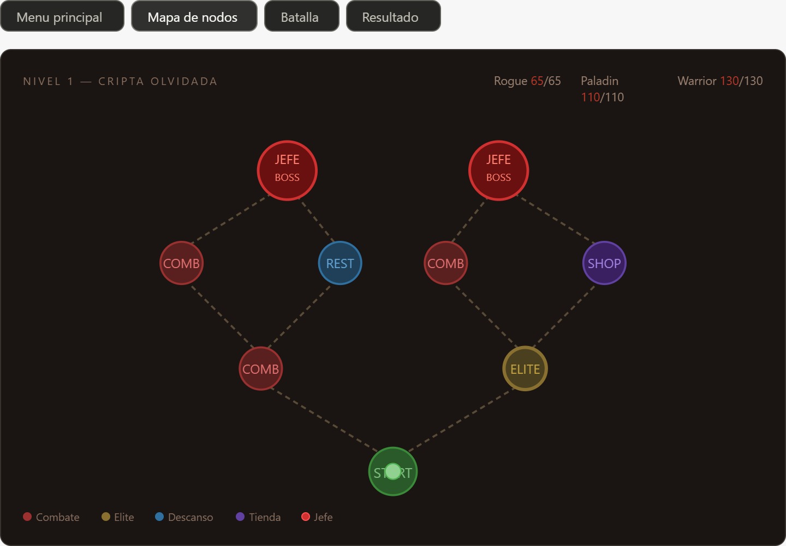
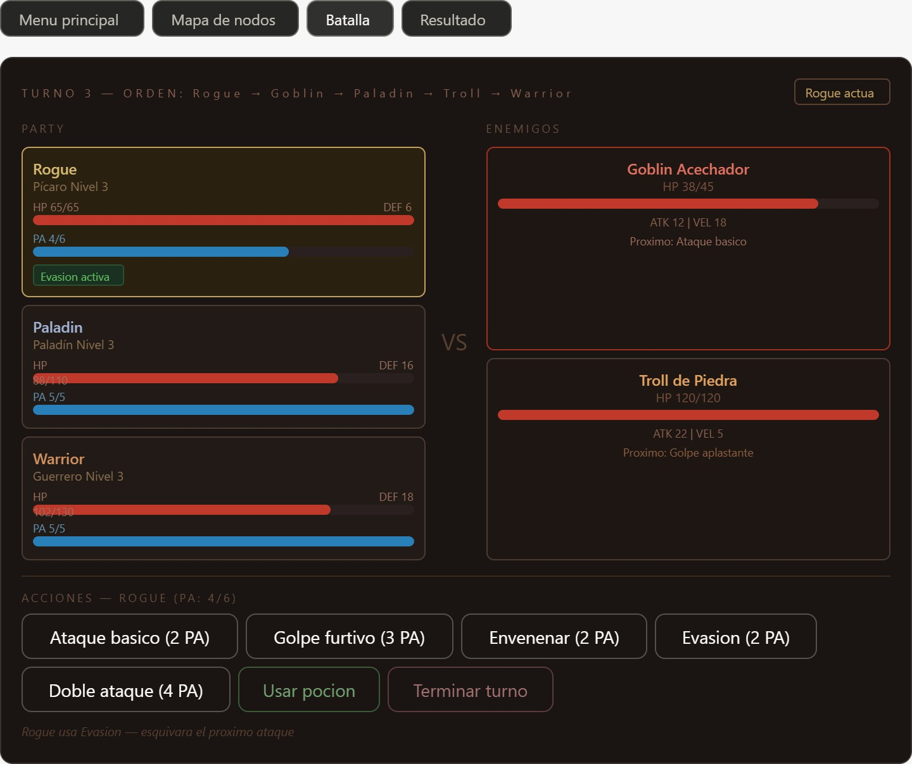
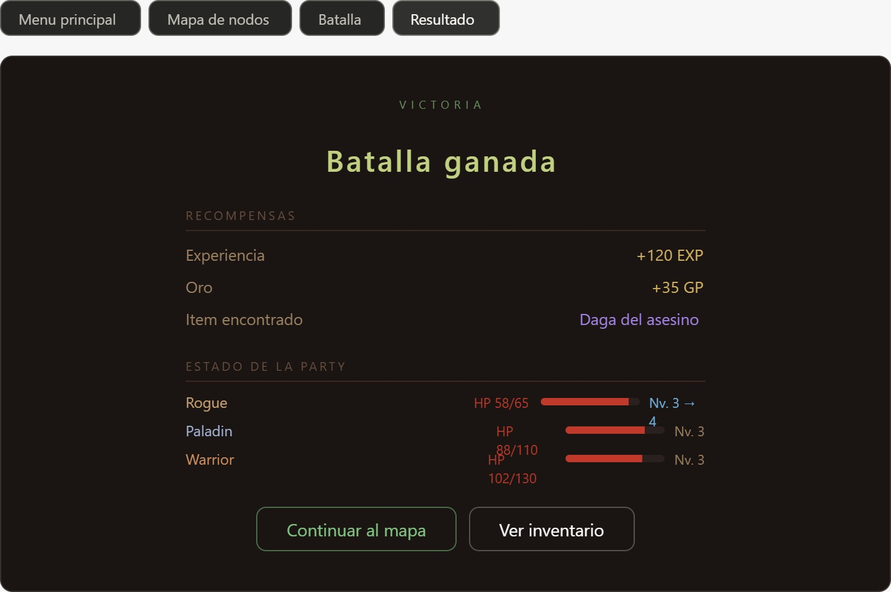

# DUNGEON TALES
**Descripción general del proyecto**
**Paradigma Orientado a Objetos — TPO | Fase A**

---

## ¿De qué se trata el juego?
Dungeon Tales es un juego de rol por turnos ambientado en un calabozo de fantasía oscura. La idea central es simple: armás una party de tres héroes y los llevás a través de un mapa lleno de peligros, combates y decisiones, hasta enfrentarte al jefe final del nivel. 

No hay exploración libre ni mundo abierto. Todo el juego gira en torno a dos mecánicas principales:
* Navegar el mapa eligiendo qué camino tomar en cada bifurcación.
* Pelear por turnos usando las habilidades de cada personaje de manera estratégica.

La estética y el tono están inspirados en *Darkest Dungeon 2*: pantallas oscuras, personajes con barras de vida visibles todo el tiempo, y una sensación de que cada decisión tiene peso. Si tu party muere, se acabó.

---

## ¿De dónde sacamos la idea?
El juego mezcla tres referentes que al grupo nos gustaron mucho:

### 1. Darkest Dungeon 2 — Estética y combate
* De acá tomamos la idea visual: personajes e enemigos enfrentados en pantalla, con barras de HP siempre visibles, efectos de estado como veneno o aturdimiento, y esa sensación de tensión oscura. 
* El combate no es un menú genérico, es una pantalla propia con peso visual.

### 2. Clair Obscur: Expedition 33 — Sistema de PA
* Este juego tiene un sistema de Puntos de Acción (PA) que nos pareció muy interesante para agregar estrategia. 
* En vez de hacer una sola acción por turno, cada personaje tiene un *pool* de PA que se recupera al inicio de su turno. 
* Los ataques básicos cuestan 2 PA, las habilidades especiales cuestan entre 2 y 5 PA. 
* Esto crea decisiones reales: ¿uso mi habilidad cara ahora o la guardo para el próximo turno?

### 3. Slay the Spire — Mapa de nodos
* En vez de un mundo lineal, el mapa funciona como un árbol con bifurcaciones. 
* Después de cada encuentro, el jugador ve dos o tres opciones de adónde ir: puede ir a otro combate, a un descanso para curar HP, a una tienda para gastar oro, o arriesgarse por un nodo élite con mejor recompensa. 
* Esta elección de ruta le da variedad y rejugabilidad al juego.

---

## Los Personajes
La party está compuesta por tres héroes de Dungeons & Dragons, cada uno con un rol claro en el combate:

* **Rogue — Kira:** * El personaje más rápido del grupo. 
  * Actúa primero en casi todos los turnos gracias a su velocidad alta (20). 
  * No tiene mucha vida ni defensa, pero hace daño elevado y puede envenenar enemigos o activar evasión para esquivar ataques. 
  * Sus cuatro habilidades son: Golpe Furtivo (hace el doble de daño si el enemigo ya está envenenado), Envenenar, Evasión y Doble Ataque.
* **Paladín — Aldric:** * El tanque y soporte de la party. 
  * Tiene la mayor defensa del grupo y puede sanar aliados con Imposición de Manos. 
  * Su ataque especial Golpe Divino ignora la defensa del enemigo, haciendo daño sagrado puro. 
  * También puede protegerse con Escudo de Fe o castigar a todos los enemigos a la vez con Castigo Sagrado.
* **Guerrero — Bronn:** * El que más pega. 
  * Tiene el HP más alto (130) y sus habilidades son puro daño o control. 
  * Golpe Brutal hace 3 veces su ataque base. 
  * Carga aturde al enemigo haciéndolo perder su turno. 
  * Grito de Batalla sube el ataque de toda la party. 
  * Torbellino golpea a todos los enemigos al mismo tiempo.

> **Nota de Sinergia:** La idea de fondo es que los tres personajes se complementan: el Rogue envenena y debilita, el Guerrero aturde y revienta, y el Paladín mantiene a todos vivos.

---

## Los Enemigos
Hay tres tipos de enemigos normales y un jefe de nivel. Cada uno tiene comportamiento diferente:

1. **Goblin Acechador:** Rápido y oportunista. Ataca dos veces seguidas con frecuencia. Fácil de matar pero puede hacerse el difícil en grupos.
2. **Esqueleto Guerrero:** Más lento pero resistente. Alterna entre ataques básicos, golpes fuertes y posturas defensivas.
3. **Troll de Piedra (Élite):** Se regenera HP cada turno. Si no lo matás rápido, se vuelve muy difícil de bajar. Su rugido baja el ataque de toda la party.
4. **La Sombra Ancestral (Jefe Final):** Más HP, más daño, puede invocar Esqueletos como refuerzo.

---

## Las pantallas del juego
A continuación explicamos qué muestra cada una de las capturas de pantalla del prototipo de interfaz que diseñamos.

### Pantalla de inicio

* Esta es la primera pantalla que ve el jugador al abrir el juego. 
* Tiene un estilo muy minimalista y oscuro, con el nombre del juego centrado en letras grandes y tres opciones: Nueva Partida, Cargar Partida y Opciones. 
* La jerarquía visual es clara: el título domina, las opciones están debajo con distintos niveles de énfasis (Nueva Partida resalta más que las otras dos). 
* El tono oscuro y la tipografía con espaciado amplio ya comunican la estética de calabozo que queremos antes de que el jugador haga nada. 
* En la versión final, el fondo tendría una ilustración sutil o un efecto de niebla animado. Por ahora el wireframe muestra la estructura y jerarquía.

### Pantalla del mapa de nodos

* Esta pantalla aparece después de cada batalla. 
* Muestra el mapa del nivel en formato árbol, de abajo hacia arriba: el jugador empieza en el nodo START (abajo al centro) y va avanzando hasta llegar al BOSS (arriba). 
* Cada nodo tiene un color y etiqueta que indica su tipo:
  * **Rojo [COMB]:** Combate normal contra enemigos aleatorios.
  * **Amarillo [ELIT]:** Enemigo élite, más difícil pero da el doble de recompensa.
  * **Azul [REST]:** Campamento. Podés curar HP de la party o meditar.
  * **Violeta [SHOP]:** Tienda para gastar el oro acumulado en pociones.
  * **Verde [TESO]:** Tesoro gratuito: EXP, oro o curación aleatoria.
  * **Rojo brillante [BOSS]:** El jefe final del nivel.
* Las líneas punteadas conectan los nodos mostrando qué caminos están disponibles. El jugador solo puede ir hacia adelante, nunca retroceder. 
* En la parte superior de la pantalla hay un resumen rápido del HP actual de cada personaje de la party. 
* La idea de fondo es que el jugador tome decisiones con información: si la party está baja de vida, conviene priorizar un nodo REST antes de seguir peleando.

### Pantalla de batalla

Esta es la pantalla más importante del juego y donde se pasa la mayor parte del tiempo. Está dividida en tres zonas:
1. **Zona izquierda (La party):** Muestra una *card* por cada personaje vivo. Cada card tiene el nombre, la clase, dos barras (HP en rojo y PA en azul) con los valores numéricos, las estadísticas de ATK y DEF, y los efectos de estado activos (veneno, escudo, evasión, etc.). La card del personaje que está actuando tiene un borde dorado para destacarse.
2. **Zona derecha (Los enemigos):** Cards similares para cada enemigo, con su HP actual y una línea que muestra qué acción planea hacer en su próximo turno (esta información le da al jugador la chance de prepararse o priorizar a quién atacar).
3. **Zona inferior (Menú de acciones):** Aparece cuando es el turno de un personaje del jugador. Muestra todas las acciones disponibles con su costo en PA. Si el personaje no tiene suficientes PA para una habilidad, esa opción aparece apagada. También tiene el botón de Usar Poción y Terminar Turno.
* El indicador de turno en la parte superior muestra el orden completo de acción para ese turno, ordenado por velocidad. Así el jugador siempre sabe quién va después.

### Pantalla de resultados

Esta pantalla aparece al terminar una batalla, ya sea con victoria o derrota. En caso de victoria muestra:
* El EXP ganado y el Oro obtenido de los enemigos derrotados.
* Si algún personaje subió de nivel, aparece resaltado con un indicador especial.
* Si se encontró algún ítem como recompensa, se muestra con su nombre y rareza.
* El estado actual de cada personaje de la party: HP restante con su barra y nivel actual.
* Desde esta pantalla el jugador puede elegir entre continuar al mapa (para elegir el próximo nodo) o abrir el inventario a revisar los ítems. 

En caso de derrota total de la party, en cambio, aparece la pantalla de *Game Over* con el mensaje correspondiente. La idea de esta pantalla es que el jugador sienta el progreso: ver los números subir, los niveles mejorar y el oro acumularse es parte de la satisfacción del género RPG.

---

## ¿En qué estado está el proyecto?
Actualmente tenemos completa la Fase A del trabajo:
* El diagrama de clases con todas las entidades del sistema y sus relaciones.
* Dos diagramas de secuencia: el flujo de combate y el flujo de navegación del mapa.
* Las cuatro pantallas de interfaz diseñadas como *wireframes* con la estética final.
* Un prototipo funcional en Java de terminal que ya corre el juego completo: mapa, combate, descanso, tienda y tesoro.

Para la **Fase B (junio)** el plan es reemplazar la interfaz de terminal con JavaFX, agregando las pantallas visuales, animaciones de combate y persistencia en archivo para guardar y cargar partidas.